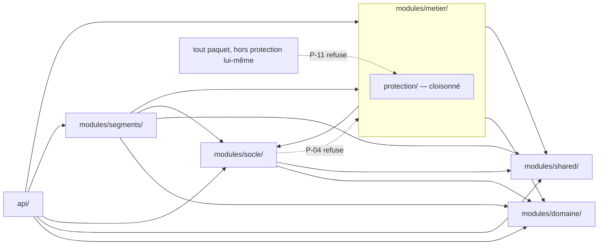
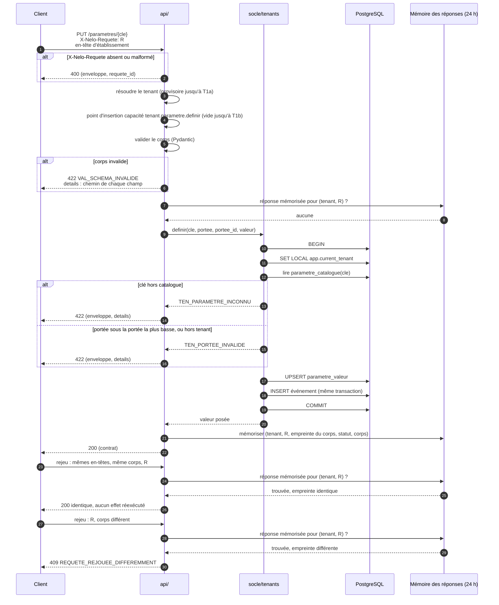
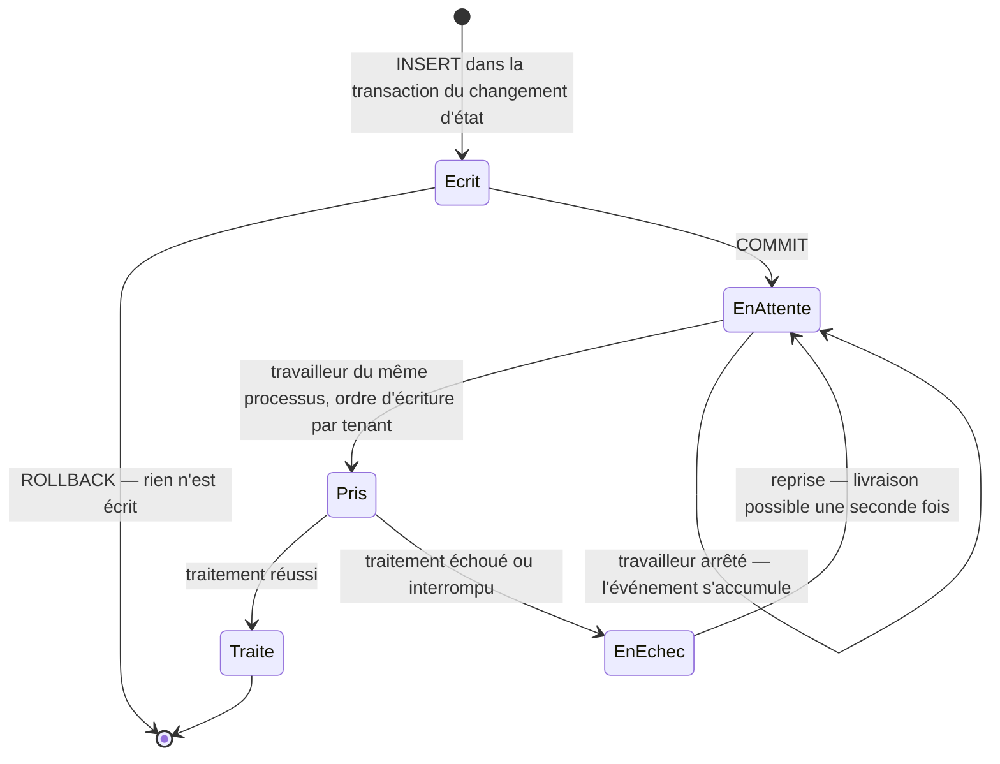
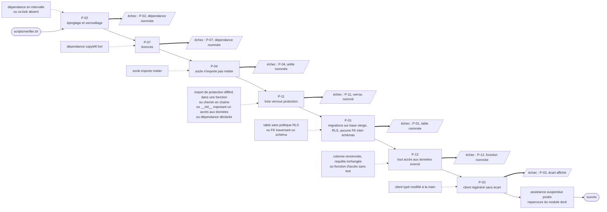
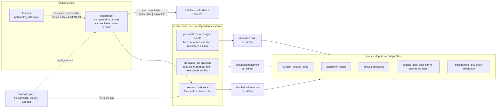

# T0a — Le socle serveur : planche de diagrammes

Revue visuelle de forme B pour [spec.md](../spec.md). Cinq diagrammes, un par question. Ce qui
n'y figure pas n'est ni dans la spécification, ni dans [docs/01-stack.md](../../../docs/01-stack.md),
ni dans [docs/03-api.md](../../../docs/03-api.md), ni dans [docs/02-domaine.md](../../../docs/02-domaine.md).

## 1. La hiérarchie des paquets et ses deux arêtes interdites — US4

Rend visible ce qu'un paquet a le droit d'importer, et les deux imports que P-04 et P-11 arrêtent.

## 2. Une écriture sur le module doré, du rejeu identique au rejeu divergent — US1, US2, US3

Rend visible l'ordre des barrières sur `PUT /parametres/{cle}` : identifiant de requête, tenant,
schéma, règle métier, puis valeur et événement dans une seule transaction.

## 3. Le cycle de vie d'un événement de la table d'événements — US3

Rend visible qu'un événement ne quitte la table que traité, et qu'un échec le ramène en attente
plutôt que de le perdre.

## 4. La chaîne de vérification et le test négatif de chaque porte — US5

Rend visible les sept portes de `scripts/verifier.sh` dans un ordre proposé du contrôle le moins
coûteux au plus coûteux — le corpus ne le fixe pas, le plan le fixera —, l'arrêt au premier rouge
en trait épais, et en pointillé le test négatif qui casse chaque porte.

## 5. Les trois dépendances externes simulées, et l'assistance dans le socle — US6, US7

Rend visible que chaque dépendance externe est appelée par son abstraction, simulée par défaut,
et que l'assistance est un paquet suspendu par une clé du catalogue, jamais un service.

